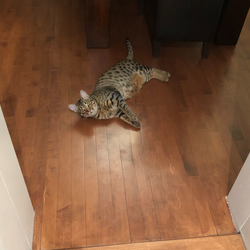

[syncat]: https://github.com/foxfriends/syncat
[syncat stylesheets]: https://github.com/foxfriends/syncat-themes
[foxfriends/paper-terminal]: https://github.com/foxfriends/paper-terminal
[ttscoff/mdless]: https://github.com/ttscoff/mdless
[lunaryorn/mdcat]: https://github.com/lunaryorn/mdcat

# paper-terminal

[](https://deps.rs/repo/github/foxfriends/paper-terminal)

<!-- Here's a comment -->

Minimal, idiomatic terminal Markdown printer. Clean, wrapped text with optional inline images via inline terminal protocols (Kitty / iTerm2 / Sixel).

Features include:

1.  The usual text, and paragraphs with automatic line-wrapping. You can manually wrap with
    hard breaks as expected.

    Otherwise, paragraphs will be nicely spaced.
2.  Headings
3.  __Bold__ / *Italic* / *__Bold and Italic__* / ~~Strikethrough~~
4.  Lists
    *   Ordered
    *   Unordered
        *   Nested

    Definition
    : This is a definition

5.  Rules
6.  `Inline code`
7.  Code blocks, with [syncat][] integration for syntax highlighting. Note that you must install
    syncat and make the syncat executable available on your path for this to work.
    ```rust
    fn main() {
        println!("Hello world");
    }
    ```
8.  Blockquotes

    >   Blockquotes
    >   >  And even nested block quotes

> [!IMPORTANT]
> Also alert blockquotes

9.  And even images! Here's a photo of my cat

    

10. Task lists:
    - [x] Easy
    - [ ] Hard
11. Footnotes[^ft]

    [^ft]: This is the footnote!

12. Tables

## Comparison with other command line Markdown renderers

Not a very good comparison... this is more of an example of a table!

| Tool                          | CommonMark | Paper | Paging | Wrapping | Syntax     | Images    | Tables | Looks good\* |
| :---------------------------- | :--------- | :---- | :----- | :------- | :--------- | :-------- | :----- | :----------- |
| [foxfriends/paper-terminal][] | Yes        | Yes   | No     | Yes      | syncat     | Pixelated | Yes    | Yes          |
| [ttscoff/mdless][]            | Yes        | No    | Yes    | No       | pygmentize | Sometimes | Yes    | No           |
| [lunaryorn/mdcat][]           | Yes        | No    | No     | No       | syntect    | Sometimes | No     | No           |

\* subjective

## Styling

By default, headings are bold; inline code is reversed. If you want syntax highlighting for fenced blocks, enable `--syncat` and ensure `syncat` is installed and on PATH.

## Installation

Paper can be installed from crates.io using Cargo:

```bash
cargo install paper-terminal
```

## Usage

```bash
# Print the help
paper --help

# Render README.md
paper README.md

# Render README.md
paper README.md
```

```
Markdown to terminal renderer

Usage: paper [OPTIONS] [FILE]...

Arguments:
  [FILE]...  Files to print

Options:
  -w, --width <WIDTH>              Target width in cells [default: 92]
  -p, --plain                      Print input without Markdown parsing
  -t, --tab-length <TAB_LENGTH>    Tab length [default: 4]
  -U, --hide-urls                  Hide link URLs
  -I, --no-images                  Disable images
  -s, --syncat                     Use syncat to highlight fenced code blocks
      --dev                        Print parser events (debug)
      --completions <COMPLETIONS>  Generate shell completions [bash, elvish, fish, powershell, zsh]
  -h, --help                       Print help
```
